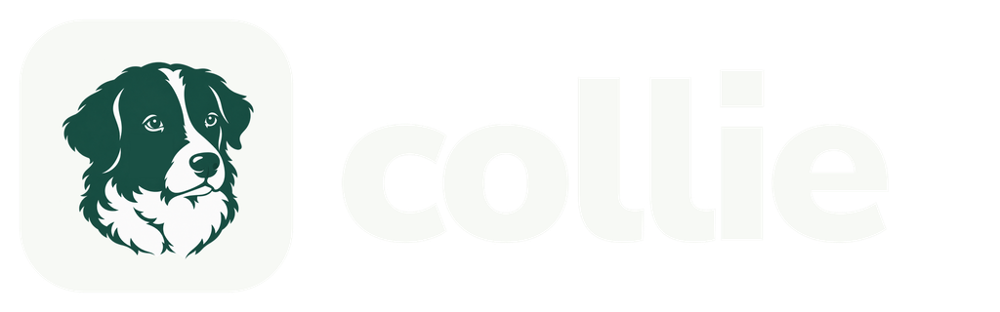

Running several coding agents at once turns into babysitting: one tab per agent, each
waiting on you at a different moment, and no single place that says what needs a decision.
Collie is the herdr plugin that takes that coordination off your hands. You pick a workflow,
Collie opens the tabs, runs the agents, reviews their work, and brings you back only for the
decisions that are yours. One board shows every task in the session: what needs you, what
is working, what finished.

## Install

Run one command. It's safe to run again, and it ends by telling you whether you're ready or
what's still missing and how to fix it:

```sh
git clone git@github.com:cego/collie.git ~/.collie && ~/.collie/setup.sh
```

Before you run it, you need:

- **herdr** installed and started once. See the [herdr install guide](https://herdr.dev/docs/install/).
- **A GitHub login**: an SSH key for the clone, and `gh auth login`, so the install can
  download the runner. **A `glab auth login` to `gitlab.cego.dk`**, so the workflows can open
  merge requests there.
- **Node**, so the install can fetch the skills the workflows use.
- **Claude Code**, logged in. The bundled workflows run their agents on it.

The install links the plugin, puts `collie` on your PATH, adds four keybindings, installs
the required skills, and runs `collie doctor`. Later, `collie upgrade` brings all of it up
to date. Helle and a Linear MCP are optional; doctor tells you when a workflow you'd run
needs one. See [Install](docs/using.md#install) and
[Optional integrations](docs/using.md#optional-integrations) for the detail.

## Four keys

| Key              | What it does                               |
| ---------------- | ------------------------------------------ |
| `prefix+f`       | Run a workflow                             |
| `prefix+u`       | Resume a run with unfinished steps         |
| `prefix+shift+f` | Fork a workflow or persona into your layer |
| `prefix+shift+c` | Open this session's Control Plane          |

`prefix` is `ctrl+b` by default. Each herdr session has one **Control Plane** in a workspace
of Collie's own: a board with one card per task, grouped by what needs you, what is
working, and what finished, with a chat pane beside it where you can ask about the work
or redirect it. `prefix+shift+c` reaches it from any pane and opens it when the session
has none yet.

## The workflows

| Workflow       | What it does                                                                                                                                              |
| -------------- | --------------------------------------------------------------------------------------------------------------------------------------------------------- |
| `plan`         | Interviews you about the goal, writes `SPEC.md` and tickets into the run directory, then offers: implement now, second opinion, offload to Linear, refine |
| `implement`    | Builds from a plan, a Linear issue, or a description on a branch of its own, has the change reviewed, fixes the findings, then opens the merge request    |
| `review`       | Reviews a merge request, a branch diff, or the working tree, writes one review, and offers to post it                                                     |
| `architecture` | Runs the architect over the project, reports into the run directory, then offers: implement now or stop                                                   |
| `renovate`     | Merges the month's Renovate merge requests on one repository, tags a release, and checks the repository off the team's Renovate issue                     |

The bundled workflows are a shared starting point, not a restriction. Fork any workflow or
persona into your own layer with `prefix+shift+f`, and change only the keys you disagree
with.

Every action is also a command, so an agent can drive Collie:

```sh
collie run start review --input target=worktree
```

## Documentation

- [Using Collie](docs/using.md): install, keybindings, the Control Plane, hand-offs, your
  defaults, troubleshooting.
- [Workflows](docs/workflows.md): what each workflow is for, what it needs, how they chain.
- [Authoring](docs/authoring.md): layers, forking, `extends:`, the full frontmatter schema.
- [CLI](docs/cli.md): commands, `--json` envelopes, exit statuses, idempotent retries.
- [Internals](docs/internals.md): architecture, the Driver, build and release, running the
  tests.
- [`CONTEXT.md`](CONTEXT.md): the vocabulary.
- [ADRs](docs/adr): the decisions and why.
- [`AGENTS.md`](AGENTS.md): where an agent working on this repo starts.
- [Brand guide](assets/brand/README.md) and [brand showcase](assets/brand/index.html):
  logos, icons, color, typography, and usage. Open the showcase in a browser, or publish
  the `assets/` directory with any static host; it has no build step.

Where Collie is going: [PRODUCT.md](PRODUCT.md).
